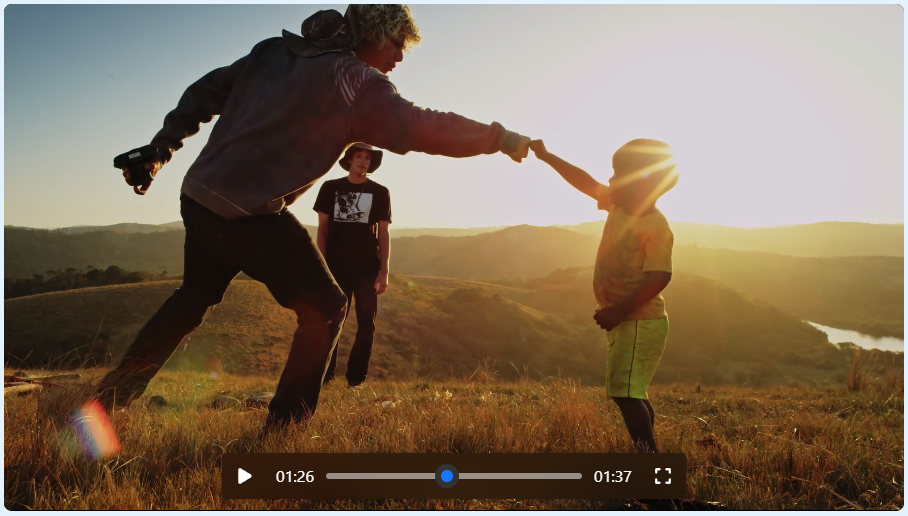

# 🎥 Video Player
This project was inspired by the default video player (Pictures) in Windows 11.

## Preview


## Setup
```html
<!-- Head -->
<link rel="stylesheet" href="./css/video-player.css">
<script src="./js/video-player.js"></script>

<!-- Body -->
<div class="video-player" id="video-player"></div>
<script>
        const player = new VideoPlayer(document.getElementById("video-player"), {
            videoCurrentTime: window.localStorage.getItem("VideoPlayerCurrentTime"),
            videoSrc: "https://cdn.plyr.io/static/demo/View_From_A_Blue_Moon_Trailer-1080p.mp4",
            videoPoster: "https://cdn.plyr.io/static/demo/View_From_A_Blue_Moon_Trailer-HD.jpg"
        });
        player.video.addEventListener("timeupdate", () => {
            window.localStorage.setItem("VideoPlayerCurrentTime", player.video.currentTime);
        });
</script>
```
