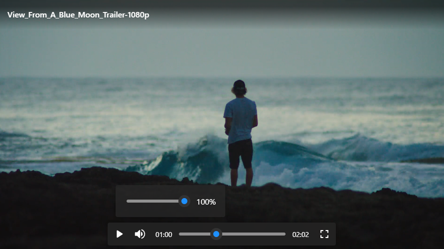

# 🎥 Video Player
This project was inspired by the default video player (Pictures) in Windows 11.

## Preview


## Setup
```html
<!-- Head -->
<link rel="stylesheet" href="./css/video-player.css">
<script src="./js/video-player.js"></script>
<style>
    .video-player {
        --videoPlayerColor: #1e90ff; /* dodgerblue */
        border-radius: 8px;
        width: 900px;
    }
</style>

<!-- Body -->
<div class="video-player" id="video-player"></div>
<script>
    const player = new VideoPlayer(document.getElementById("video-player"), {
        src: "https://cdn.plyr.io/static/demo/View_From_A_Blue_Moon_Trailer-1080p.mp4",
        name: "View_From_A_Blue_Moon_Trailer-1080p",
        currentTime: window.localStorage.getItem("VideoPlayerCurrentTime")
    });
    player.video.addEventListener("timeupdate", () => {
        window.localStorage.setItem("VideoPlayerCurrentTime", player.video.currentTime);
    });
</script>
```
